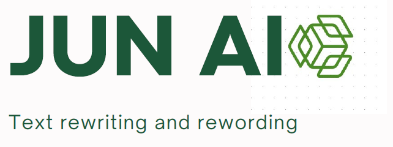

# JUN-AI-Rewording-Grammatical-Error-Correction-and-Plagiarism-detection-with-T5-Transformer



## ***Overview***
**Jun AI (Rewording, Grammatical Error Correction, and Plagiarism Detection)** is a project poised for long term performance. Given the time at our disposal, we have successfully completed the grammatical error
correction aspect, which is one of the fundamental pillars of this project. Following the implementation of vario us models (`RNN`, `LSTM`, `T5 Model`), we can highlight the transformer based T5 model (`Happy Transformer`) and the OpenAI model based on GPT 3.5 for our product. This achievement already addresses three strengths of our product, namely improved data quality (the enhancement of the overall quality of the data used in the Jun AI project. In the context of grammatical error correction and plagiarism detection, improving data quality could involve refining the training data used for machine learning models.), versati lity (the system can effectively address different types of grammatical errors, diverse writing styles, and a range of content. For the moment only English sentences), and increased productivity for the customer (contributes to saving time and effort for i ts users. In the context of grammatical error correction and plagiarism detection, a highly productive tool like our product, would efficiently and accurately identify and correct errors, thereby reducing the time and manual effort required for proofreading).

***Dataset description***

JFLEG (JHU FLuency-Extended GUG) is an English grammatical error correction (GEC) corpus. It is a gold standard benchmark for developing and evaluating GEC systems with respect to fluency (extent to which a text is native-sounding) as well as grammaticality. For each source document, there are four human-written corrections.

**Supported Tasks and Leaderboards**
Grammatical error correction.

**Languages**
English (native as well as L2 writers)

**Dataset Structure**
Data Instances
Each instance contains a source sentence and four corrections. For example:
```{python}
{
  'sentence': "They are moved by solar energy ."
  'corrections': [
    "They are moving by solar energy .",
    "They are moved by solar energy .",
    "They are moved by solar energy .",
    "They are propelled by solar energy ." 
  ]
}
```

**Data Fields**
*sentence:* original sentence written by an English learner
*corrections:* corrected versions by human annotators. The order of the annotations are consistent (eg first sentence will always be written by annotator "ref0").

**Data Splits**

- This dataset contains **1511** examples in total and comprise a dev and test split.
- There are **754** and **747** source sentences for dev and test, respectively.
- Each sentence has **4** corresponding corrected versions.
